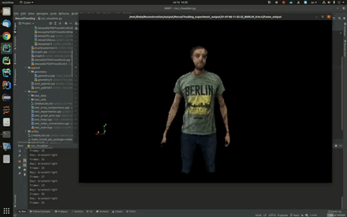

# NNRT Fusion 

This repository is a work-in-progress on the application of the Neural Non-Rigid Tracking code by Aljaz Bozic and Pablo Palafox to an actual fusion application that can process entire RGB-D video sequences. 

## July 2021 Result YouTube Video ##
[](https://youtu.be/lrFXuSWLmy8 "NeuralTracking Dynamic Fusion Pipeline Result (July 2021)")

## Architecture Choices ##

Part of the pipeline is an extension to Open3D, because it yields two advantages over most alternatives:

1) Support for dynamically-allocated spatial voxel hash structures to manage the TSDF voxel volume in a sparse, computationally-efficient way.
2) Support for color within the TSDF voxel structure, enabling to rebuild colored, animated meshes. 

We are also currently experimenting with PyTorch3D in order to be able to render a mesh, which may yield certain tracking improvements if we manage to successfully integrate deformed mesh rendering into the Gauss-Newton alignment optimization to refine point associations.

## Setup Instructions ##
#### (mostly, for fellow researchers & developers at this point) ####

### Cloning The Repo ###

Testing & working on the code requires `git`, since we didn't make any releases so far. In terminal or msys git shell for Windows, clone this repository [recursively](https://stackoverflow.com/a/4438292/844728).

### Dependencies ###

**Important:** please follow the order of these topics during setup.

#### CUDA ####
Although in theory, it is possible to build and run the fusion pipeline without CUDA, it would be pretty slow on large scenes or with high resolutions. Hence, we recommend having CUDA 11.1 (or the latest version of cuda supported by both PyTorch and CuPy) installed on your platform (guides for [Linux](https://docs.nvidia.com/cuda/cuda-installation-guide-linux/index.html), [Windows](https://docs.nvidia.com/cuda/cuda-installation-guide-microsoft-windows/index.html), [MacOS X](https://docs.nvidia.com/cuda/archive/9.2/cuda-installation-guide-mac-os-x/index.html)). The rest of these instructions assume you followed this recommendation, otherwise please adjust accordingly.

#### CMake ####

The build requires CMake 3.18 or above. You may find [these instructions](media/Open3D_Build_Instructions.md) helpful if you don't have it.

#### Python ####

Python 3.8 or above is required. Check out the official [website](https://www.python.org/downloads/) for a distributive for your platform, if needed. In addition, working `pip` package is required to set up other dependencies (typically, included with the Python installation; if not, the [get-pip.py](https://pip.pypa.io/en/stable/installation/) is the recommended way to obtain it, even for Ubuntu users.) 

#### PyTorch ####
PyTorch 1.9.0 or later should be installed following the standard `Pip` procedure from the PyTorch official ['Get Started' page](https://pytorch.org/get-started/locally). Please use matching PyTorch and CuPy CUDA version support, even though PyTorch for older CUDA builds sometimes works with the newer ones. Otherwise, there will be import errors due library loading conflicts. 

#### Open3D ####
Unlike PyTorch, Open3D still needs to be built from source in order to use CUDA. Hence, clone the [repository](https://github.com/isl-org/Open3D) and checkout the `3147bd1ba` commit (the Open3D C++ API is still very fluid, so we cannot recommend a specific release yet). Then, make sure to [initialize and update the submodules](https://stackoverflow.com/a/4438292/844728).

Here are the [detailed instructions](media/Open3D_Build_Instructions.md) on how to go about building Open3D with CUDA support after you obtain the sources.

### Building the C++ Open3D extension ###

This should be relatively simple as it follows the general pattern of [building Open3D](media/Open3D_Build_Instructions.md). For the CMake options, the `BUILD_CUDA_MODULE` option is set by default to `ON`, but we recommend setting `-DBUILD_CPP_TESTS=ON` as well to be able to run C++ tests and write your own tests for debugging purposes.

Note that you will currently need to install `ninja` on your platform to compile the NNRT python module. Setting it up should be [trivial](https://github.com/ninja-build/ninja/wiki/Pre-built-Ninja-packages).

As far as CMake build targets go, the `nnrt_cpp` target is only necessary to build the tests. The `install-pip-package` target is the one you'll want to have built to try out the rest of the code with the `nnrt` python package.

#### Other Python Dependencies ####

The only one that stands out is [CuPy](https://docs.cupy.dev/en/stable/install.html), which we recommend preinstalling via pip using the prebuilt-binary version matching your exact CUDA version, e.g. `pip install cupy-cuda111` for CUDA 11.1. Installing directly via `pip install cupy` will force CuPy to be built from source (which can take a long time). The rest of the dependencies can normally be installed by simply running `pip install -r requirements.txt`.

### Preparing the Data ###

**Note**: make sure to prepend the `PYTHONPATH` environment variable with the repository root before running any of the scripts! 

Although, in theory, the code is designed to handle arbitrary 640x480 RGB-D sequences, we recommend trying out the code on the [DeepDeform dataset](https://github.com/AljazBozic/DeepDeform). Graph data is also necessary to train/retrain the alignment prediction models and to run the fusion code with certain settings that use pre-generated data. 

DeepDeform Graph data should already be included by default within DeepDeform V2 dataset, but can also be obtained [here](http://kaldir.vc.in.tum.de/download/deepdeform_graph_v1.7z) and merged into the DeepDeform dataset using the `data/add_in_graph_data.py` script (see `--help` of this script for usage.) Alternatively, the graph data can be generated using the `apps/create_graph_data.py` script for arbitrary sequences after the C++ pip package is built (see main method in the script for parameter configuration).

On the first run of `run_fusion.py`, you'll see some errors pop up. One of them will undoubtedly relate to incorrect path to the DeepDeform dataset root in the auto-generated `nnrt_fusion_parameters.yaml` configuration file, which will appear inside `[repository_root]/configuration_files`. To fix this, modify the value of `path.dataset_base_directory` in the configuration file to point to the proper DeepDeform root. It may make sense to adjust other `path` parameters right away as you see fit, since the app will output a high volume of telemetry to disk.

Some other errors may be due to missing "sod" folders for some presets in the `data/presets.py`. This is about missing salient-object-detection masks, which can be used to refine the background subtraction during fusion. You can either comment those presets out and use the alternatives in `settings/settings_fusion.py`, or you can run the included U^2 Net script to generate the masks (see instructions [here](media/SOD_Generation_Instructions.md)).   

### Running Unit Tests ###

**Note**: make sure to prepend the `PYTHONPATH` environment variable with the repository root before running any python tests.

We include both C++ and Python unit tests, within the `csrc/tests` and `tests` folders, respectively. The tests lack coverage (especially of the code that we didn't write ourselves, e.g. the original NNRT repository code), but should serve as a good sanity check and checkpoint for future development, and also provide examples for future unit tests.

Please refer to guides on [pytest](https://docs.pytest.org/en/6.2.x/example/simple.html) for how to run the Python tests. The C++ tests use Catch2 and can be run as executables if `-DBUILD_CPP_TESTS=ON` was used in CMake configuration. 

### Configuring & Running the Fusion Pipeline ###

Settings dealing with running the fusion pipeline can be found in
`settings/settings_fusion.py`. As you will discover, some setting combinations don't work by design. Most of the settings should be self-explanatory, please refer to their usage in `apps/fusion/pipeline.py` for details.

**Note**: make sure to prepend the `PYTHONPATH` environment variable with the repository root before running any of the scripts!

The fusion pipeline can be run using:

```shell
python apps/fusion/pipeline.py
```

### Visualizing the Results ###

The output for each run will be stored in a new subfolder containing the date and time (in sortable format) of when the run was launched. The subfolder will be placed in your preferred output directory (see [Preparing the Data](https://github.com/Algomorph/NeuralTracking/#preparing-the-data) above).

To visualize the output for a particular sequence saved at `<path_to_output_subfolder>`, run:

```shell
python run_visualizer.py -o <path_to_output_subfolder>/frame_output
```

In the visualizer, you can use the following key combinations to navigate the output:

* `P`: toggle point cloud visibility for Gauss-Newton optimization
* `]`: go to next frame
* `[`: go to previous frame
* `M`: toggle extracted mesh visibility
* `->`: switch to warped (deformed) mesh or next frame & canonical (reference) mesh
* `<-`: switch to canonical (reference) mesh or previous frame & warped (deformed mesh)
* `Down Arrow`: advance _iteration_ of the Gauss-Newton optimization (updates the point cloud) or go to next frame if on last iteration
* `Up Arrow`: go to previous _iteration_ of the Gauss-Newton optimization (updates the point cloud) or go to previous frame if on first iteration
* `Q`: exit the visualizer

## License Information ##

Any original code in this repository that does not come from the original [Neural Non-Rigid Tracking repository](https://github.com/DeformableFriends/NeuralTracking), except where explicitly specified otherwise, is licensed under the [Apache License, Version 2.0 (the "License")](LICENSE).

# [Based on] Neural Non-Rigid Tracking (NeurIPS 2020)

The original Neural Non-Rigid Tracking `README` is still relevant for this repo and provided below.

### [Project Page](https://www.niessnerlab.org/projects/bozic2020nnrt.html) | [Paper](https://arxiv.org/abs/2006.13240) | [Video](https://www.youtube.com/watch?time_continue=1&v=nqYaxM6Rj8I&feature=emb_logo) | [Data](https://github.com/AljazBozic/DeepDeform)


This repository contains the code for the NeurIPS 2020 paper [Neural Non-Rigid Tracking](https://arxiv.org/abs/2006.13240), where we introduce a novel, end-to-end learnable, differentiable non-rigid tracker that enables state-of-the-art non-rigid reconstruction.

By enabling gradient back-propagation through a weighted non-linear least squares solver, we are able to learn correspondences and confidences in an end-to-end manner such that they are optimal for the task of non-rigid tracking.

Under this formulation, correspondence confidences can be learned via self-supervision, informing a learned robust optimization, where outliers and wrong correspondences are automatically down-weighted to enable effective tracking.


## Installation

Please follow instructions for the Fusion project above. The original NNRT setup instructions with Docker or Python virtualenv is no longer up-to-date.

## I just want to try it on two frames!

If you just want to get a feeling of the whole approach at inference time, you can run

```
python apps/example_viz.py
```

to run inference on a couple of source and target frames that you can already find at [example_data](example_data). For this, you'll be using a model checkpoint that we also provide at [experiments](nn_data).

Within the [Open3D](http://www.open3d.org/) viewer, you can view the following by pressing these keys:

* `S`: view the source RGB-D frame
* `O`: given the source RGB-D frame, toggle between the complete RGB-D frame and the foreground object we're tracking
* `T`: view the target RGB-D frame
* `B`: view both the target RGB-D frame and the source foreground object
* `C`: toggle source-target correspondences
* `W`: toggle weighted source-target correspondences (the more red, the lower the correspondence's weight)
* `A`: (after having pressed `B`) **align** source to target
* `,`: rotate the camera once around the scene
* `;`: move the camera around while visualizing the correspondences from different angles
* `Z`: reset source object after having aligned with `A`


## Train

You can run

```
./run_train.sh
```

to train a model. Adapt `options.py` with the path to the dataset. You can initialize with a pretrained model by setting the `use_pretrained_model` flag.

To reproduce our complete approach, training proceeds in four stages. To this end, for each stage you will have to set the following variables in `options.py`:

1. `mode = "0_flow"` and `model_name = "chairs_things"`.
2. `mode = "1_solver"` and `model_name = "<best checkpoint from step 1>"`.
3. `mode = "2_mask"` and `model_name = "<best checkpoint from step 2>"`.
4. `mode = "3_refine"` and `model_name = "<best checkpoint from step 3>"`.

Each stage should be run for around 30k iterations, which corresponds to about 10 epochs.


## Evaluate

You can run

```
./run_generate.sh
```

to run inference on a specified split (`train`, `val` or `test`). Within `./run_generate.sh` you can specify your model's directory name and checkpoint name (note that the path to your experiments needs to be defined in `options.py`, by setting `workspace`.)

This script will predict both graph node deformation and dense deformation of the foreground object's points.

Next, you can run

```
./run_evaluate.sh
```

to compute the `Graph Error 3D` (graph node deformation) and `EPE 3D` (dense deformation).

Or you can also run

```
./run_generate_and_evaluate.sh
```

to do both sequencially.


## Known Issues

[Undefined symbol when building cpp extension](https://discuss.pytorch.org/t/undefined-symbol-when-import-lltm-cpp-extension/32627/4)


## Citation
If you find our work useful in your research, please consider citing:

	@article{
	bozic2020neuraltracking,
	title={Neural Non-Rigid Tracking},
	author={Aljaz Bozic and Pablo Palafox and Michael Zoll{\"o}fer and Angela Dai and Justus Thies and Matthias Nie{\ss}ner},
	booktitle={NeurIPS},
	year={2020}
    }


## Related work
Some other related work on non-rigid tracking by our group:
* [Bozic et al. - DeepDeform: Learning Non-rigid RGB-D Reconstruction with Semi-supervised Data (2020)](https://niessnerlab.org/projects/bozic2020deepdeform.html)
* [Li et al. - Learning to Optimize Non-Rigid Tracking (2020)](https://niessnerlab.org/projects/li2020learning.html)


## License

The original code from the [Neural Non-Rigid Tracking Repository](https://github.com/DeformableFriends/NeuralTracking) is released under the [MIT license](alignment/LICENSE), except where otherwise stated (i.e., `pwcnet.py`, `Eigen`).
